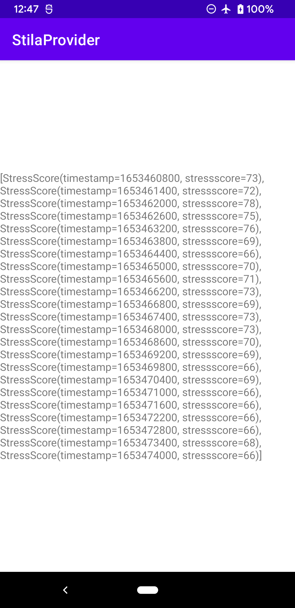
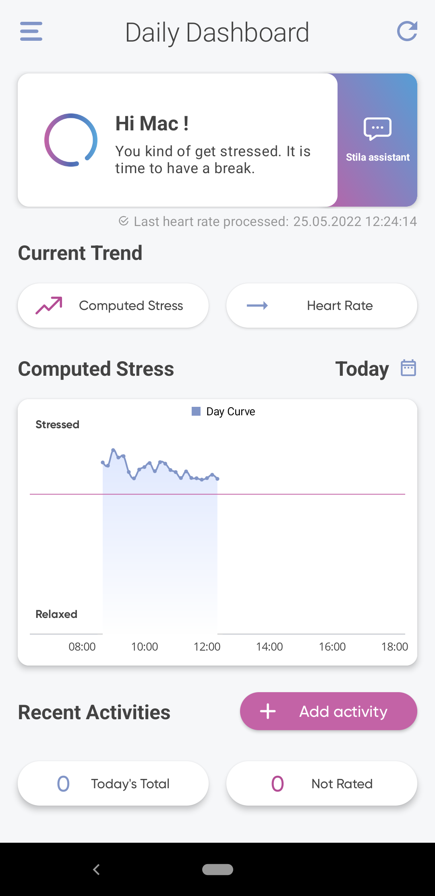

# Introduction

this repository contains a demo app showing how to fetch stila stress data with a `contentResolver`

## Steps to reproduce
1. add `<use-permission>` and `<queries><provider>` tags in `AndroidManifest.xml` to allow access to `stila stress score`
2. Follow the code examples in `MainAcitvity` to fetch the stila stress score with coroutine using `contentResolver` to `query` the `Stila App ContentProvider`

## Demo Screenshots of the Stila Provider Example App

